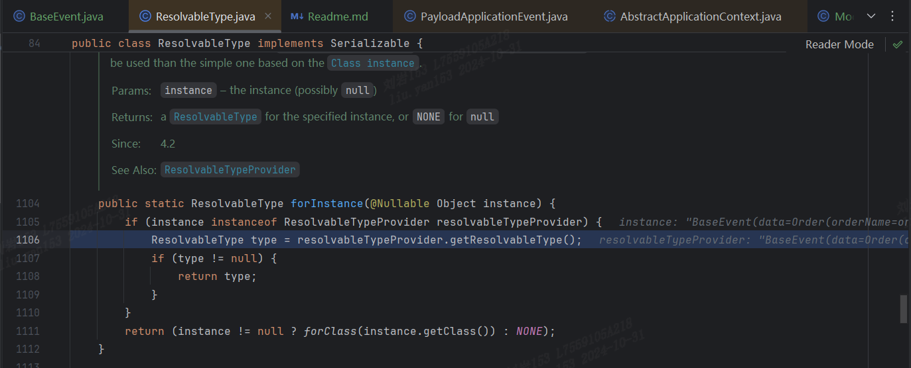
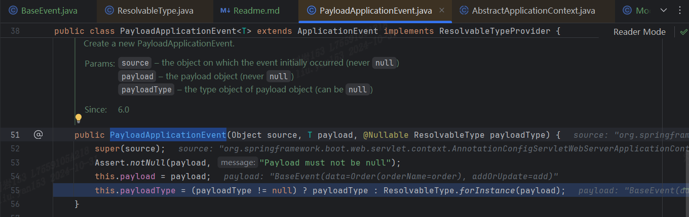
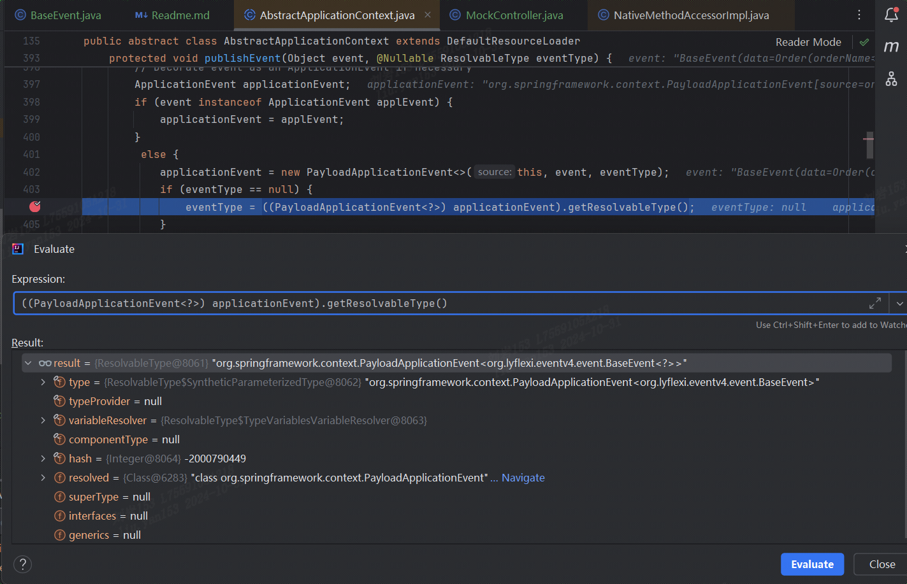

Spring在泛型情况下的事件处理解决方案：

> https://docs.spring.io/spring-framework/reference/core/beans/context-introduction.html#context-functionality-events-generics

# 实现接口ResolvableTypeProvider
```java
@Data
public class BaseEvent<T>  implements ResolvableTypeProvider {
    private T data;
    private String addOrUpdate;

    public BaseEvent(T data, String addOrUpdate) {
        this.data = data;
        this.addOrUpdate = addOrUpdate;
    }

    @Override
    public ResolvableType getResolvableType() {
        return ResolvableType.forClassWithGenerics(getClass(), ResolvableType.forInstance(getData()));
    }
}
```
# 断点调试
## 在方法实现的入口处打上断点


跟踪堆栈信息，定位到ResolvableType.java, 在静态方法forInstance中找到了ResolvableTypeProvider#getResolvableType方法的调用


弹栈追踪 PayloadApplicationEvent.java


## 新的断点
弹栈追踪AbstractApplicationContext.java


终于发现，这里的PayloadApplicationEvent#getResolvableType()给我们返回了带有泛型信息的BaseEvent<Order>
```java
org.springframework.context.PayloadApplicationEvent<org.lyflexi.eventv4.event.BaseEvent<org.lyflexi.eventv3.entity.Order>>
```

解决了泛型擦除了问题


# 如果说不实现接口ResolvableTypeProvider再次调试
```java
@Data
public class BaseEvent<T>  /*implements ResolvableTypeProvider */{
    private T data;
    private String addOrUpdate;

    public BaseEvent(T data, String addOrUpdate) {
        this.data = data;
        this.addOrUpdate = addOrUpdate;
    }

/*    @Override
    public ResolvableType getResolvableType() {
        return ResolvableType.forClassWithGenerics(getClass(), ResolvableType.forInstance(getData()));
    }*/
}
```
发现这里的泛型信息被擦除成？了，这也就是泛型event不生效的原因
```java
org.springframework.context.PayloadApplicationEvent<org.lyflexi.eventv4.event.BaseEvent<?>>
```


